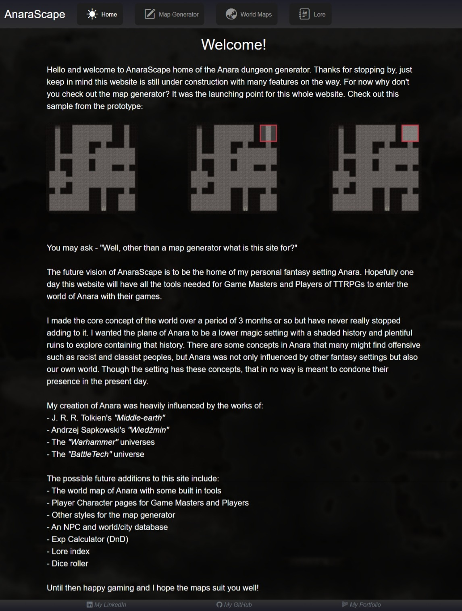
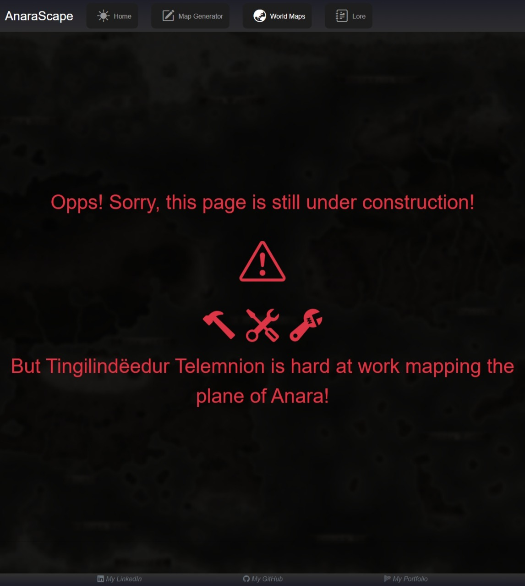
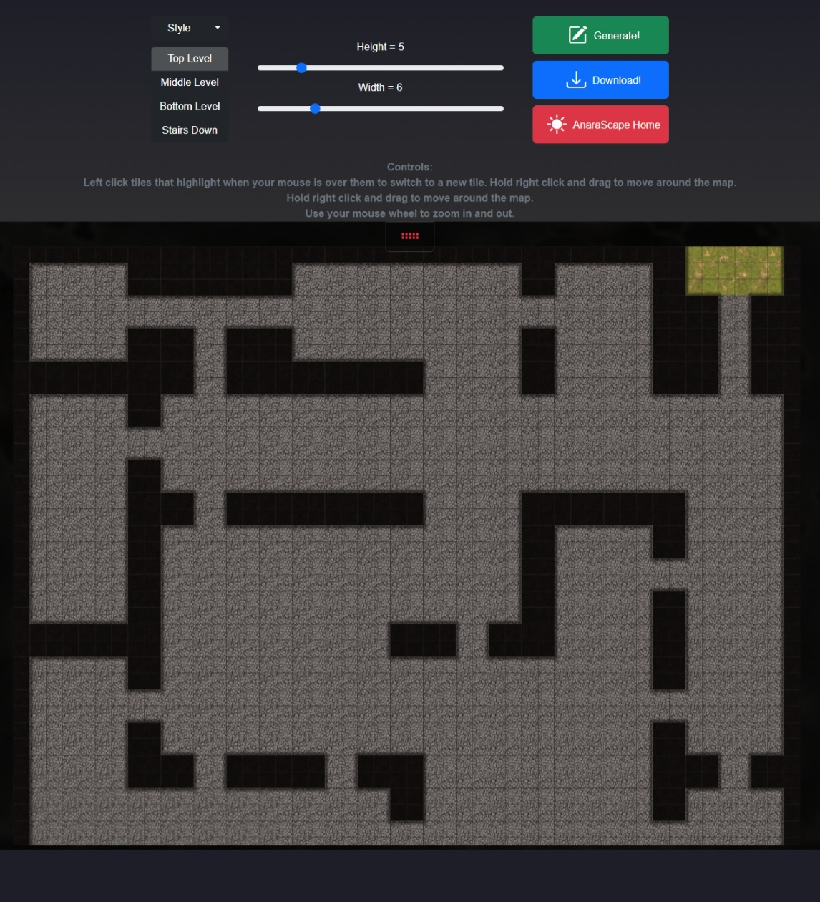
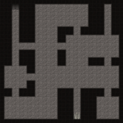
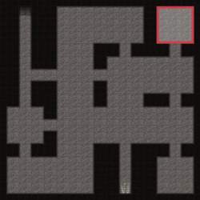

# AnaraScape
A Random TTRPG Dungeon Generation Website

This is what the home page looks like:

More features to come!

`Still under construction`,
If you see this page it means you've reached a page that has not been finished yet.

## Map Samples

Here is the tool bar for making maps and some samples:

## Future Possible Additions

1. World map with integrated calendar

    - Ability to save location of the party on world map

    - Ability to calculate the distance of travel using the world map (party can travel along route as the date advances)

2. PC tracking for DMs

    - Can have notes specific for a certain PC

    - Shows Backstory etc.

3. Exp Calculator

4. Dice roller

## Build & Dependencies
 Build: .NET 8.0

### Dependencies:
(You should check the licenses below yourself)

 - bootstrap 5.3.3 (MIT)
 - bootstrap-icons 1.11.3 (MIT)
 - Dapper 2.1.35 (Apache 2.0)
 - SkiaSharp via -> Microsoft.Maui.Graphics.Skia 8.0.60 (LibraryCS59.ImageProcessing) (MIT)

## Resources 

https://learn.microsoft.com/en-us/aspnet/core/blazor/?view=aspnetcore-8.0
